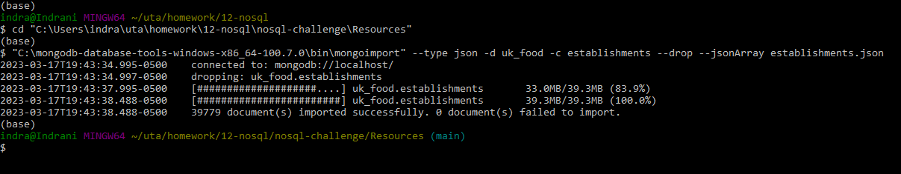

# nosql-challenge
## Background
The UK Food Standards Agency evaluates various establishments across the United Kingdom, and gives them a food hygiene rating. I am contracted by the editors of a food magazine, Eat Safe, Love, to evaluate some of the ratings data in order to help their journalists and food critics decide where to focus future articles.

## Part 1: Database and Jupyter Notebook Set Up

Used `NoSQL_setup_starter.ipynb` for this section of the challenge.
  1. Imported the provided in the `establishments.json` file from my Terminal. Name the database `uk_food` and the collection `establishments`. 
  

  2. Imported necessary libraries I needed: PyMongo and Pretty Print (`pprint`)
  3. Created an instance of the Mongo Client.
  4. Confirmed that the database is created and loaded properly:
      * Listed the databases I have created in MongoDB. Confirmed that `uk_food` is listed.
      * Listed the collection(s) in the database to ensure that `establishments` is there.
      * Found and displayed one document in the `establishments` collection using `find_one` and diplayed with `pprint`.
      
  5. Assigned the `establishments` collection to a variable to prepare the collection for use.

## Part 2: Update the Database
Used `NoSQL_setup_starter.ipynb` for this section of the challenge.

The magazinze editiors have some requested modificaitons for the database before I can perform any queries or analysis for them. Made the following changes to the `establishments` collection:

  1. An exciting new halal restaurant just opened in Greenwich, but hasn't been rated yet. The magazine has asked me to include it in my analysis. I added the following information to the database:

      ```python
      {
          "BusinessName":"Penang Flavours",
          "BusinessType":"Restaurant/Cafe/Canteen",
          "BusinessTypeID":"",
          "AddressLine1":"Penang Flavours",
          "AddressLine2":"146A Plumstead Rd",
          "AddressLine3":"London",
          "AddressLine4":"",
          "PostCode":"SE18 7DY",
          "Phone":"",
          "LocalAuthorityCode":"511",
          "LocalAuthorityName":"Greenwich",
          "LocalAuthorityWebSite":"http://www.royalgreenwich.gov.uk",
          "LocalAuthorityEmailAddress":"health@royalgreenwich.gov.uk",
          "scores":{
              "Hygiene":"",
              "Structural":"",
              "ConfidenceInManagement":""
          },
          "SchemeType":"FHRS",
          "geocode":{
              "longitude":"0.08384000",
              "latitude":"51.49014200"
          },
          "RightToReply":"",
          "Distance":4623.9723280747176,
          "NewRatingPending":True
      }
      ```

  2. Found the BusinessTypeID for "Restaurant/Cafe/Canteen" and return only the `BusinessTypeID` and `BusinessType` fields.
  3. Updated the new restaurant with the `BusinessTypeID` I found.
  4. The magazine is not interested in any establishments in Dover, so checked how many documents contain the Dover Local Authority. Then, removed any establishments within the Dover Local Authority from the database, and checked the number of documents to ensure they were deleted.
  5. Some of the number values are stored as strings, when they should be stored as numbers. Used `update_many` to convert `latitude` and `longitude` to decimal numbers.

## Part 3: Exploratory Analysis
Eat Safe, Love has specific questions they want me to answer, which will help them find the locations they wish to visit and avoid.

Used `NoSQL_analysis_starter.ipynb` for this section of the challenge.

Some notes for exploring the dataset:
  * `RatingValue` refers to the overall rating decided by the Food Authority and ranges from 1-5. The higher the value, the better the rating.
  * The scores for Hygiene, Structural, and ConfidenceInManagement work in reverse. This means, the higher the value, the worse the establishment is in these areas.

Used the following questions to explore the database, and find the answers, so I can provide them to the magazine editors.

  * Used `count_documents` to display the number of documents contained in the result.
  * Display the first document in the results using `pprint`.
  * Convert the result to a Pandas DataFrame, print the number of rows in the DataFrame, and display the first 10 rows.
     
  1. Which establishments have a hygiene score equal to 20? 

  2. Which establishments in London have a RatingValue greater than or equal to 4?

  3. What are the top 5 establishments with a `RatingValue` of '5', sorted by lowest hygiene score, nearest to the new restaurant added, "Penang Flavours"?

  4. How many establishments in each Local Authority area have a hygiene score of 0? Sort the results from highest to lowest, and print out the top ten local authority areas.
 

    

  
  

  
  
  

  
    
    
    
    